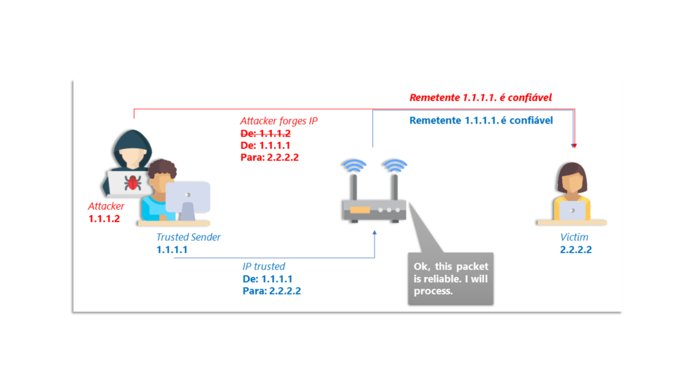

# **ATAQUES INFORMÁTICOS COMUNES**

En este apartado se indicaran dos de los ataques más informáticos comunes que podemos encontrar hoy en día y de los que deberemos tener cuidado.

## 1. IP SPOOFING TO BYPASS NETWORK SECURITY

El llamado IP spoofing es una técnica en la que se envían paquetes de datos TCP/[IP](https://www.ionos.es/digitalguide/servidores/know-how/internet-protocol-definicion-y-fundamentos/) o **[UDP](https://www.ionos.es/digitalguide/servidores/know-how/udp-user-datagram-protocol/)**/IP con una dirección de remitente falsa. Para **inyectar sus propios paquetes en un sistema externo**. 

### 1.2 ¿Cómo funciona?

El atacante utiliza la dirección de un sistema autorizado y de confianza, que de otra manera sería bloqueado por un sistema de filtrado. En la mayoría de los casos, el IP spoofing se utiliza para realizar ataques **Dos** y **DDos** Sin embargo, bajo ciertas circunstancias, el atacante también puede interceptar y manipular el tráfico IP entre dos o más sistemas informáticos. A este tipo de ataques se les conoce como **man in the middle**  y, al igual que el IP spoofing (con tan solo unas pocas excepciones), requieren que el atacante se encuentre en la misma **subred** que la víctima.

## La razón de ser del IP spoofing es la suplantación

Suplantar la dirección IP es posible gracias a que la dirección de origen y de destino que cada paquete IP contiene en su **encabezado** no están lo suficientemente protegidas contra la manipulación. Desafortunadamente no hay mecanismos para cifrar esta información ni para comprobar su veracidad. Sin embargo, con un simple ataque de IP spoofing el atacante no obtiene acceso al tráfico de datos. Es decir, este solo puede cambiar la dirección en el paquete correspondiente, mientras que **la dirección IP real se mantiene sin cambios**. Así, la respuesta con los datos emitidos no llegará al atacante, sino a la dirección del ordenador que este introdujo.

El sistema que recibe la solicitud no tiene forma de saber que un tercero sin autorización se encuentra detrás del paquete IP, lo que hace que el IP spoofing sea de gran utilidad para los mencionados **ataques DoS y DDoS**. En particular, los dos siguientes escenarios son posibles:

1. Basándose en la dirección de origen, el atacante envía **muchos paquetes de datos a varios sistemas** dentro de la respectiva red. Estos responden enviando un paquete de datos al ordenador cuya dirección fue usurpada.
2. Un host de destino recibe, al mismo tiempo, **muchos paquetes de datos por parte de varias direcciones IP suplantadas** y, por lo tanto, se sobrecarga.

#### 1.4 ¿Cómo contrarrestar el spoofing?

Para evitar que un atacante falsifique tu dirección IP y la utilice para fines inescrupulosos, tienes la posibilidad de tomar la iniciativa mediante la creación de tus propios mecanismos de protección. Así, te recomendamos concentrarte en las dos siguientes medidas:

- **Establece una solución integral de filtrado de paquetes para tu router**. Este se encargará de analizar y descartar aquellos paquetes cuyas direcciones de origen no provengan de la propia red. Deberás hacerte cargo incluso del **filtrado de paquetes salientes** con direcciones de remitente que estén fuera de tu red, a pesar de que, en este sentido, los expertos en seguridad lo consideren como un deber del proveedor de servicios.

- **Mantente alejado del método de autenticación basado en el host**. Asegúrate de que todos los métodos de registro de entrada se realicen a través de conexiones cifradas. De esta forma minimizarás el riesgo de un ataque de IP spoofing dentro de tu red y estarás fijando importantes estándares de seguridad. 

otros:

- Autentificar la dirección mediante algoritmos criptográficos, como IPsec, SSL o SSH.
- Utilizar VPNs.

